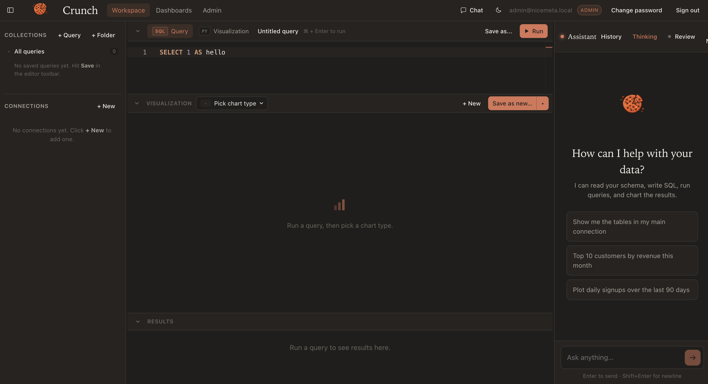

# Crunch

**Open-source Business Intelligence platform** — a Metabase alternative with a
Cursor-style workspace and a built-in Anthropic-powered assistant.



> Crunch was previously named NiceMeta. The project's Python package
> identifier (`nicemeta`), the legacy SQLite filename, and the default
> admin email still use the old name for backward compatibility with
> existing installs.

```
┌──────────────────┐   HTTP    ┌──────────────────┐   HTTP   ┌──────────────────┐
│  Vue 3 frontend  │  ──────►  │  Express + TS    │  ──────► │  Python engine   │
│  (Vite, Pinia,   │  /api     │  backend         │          │  (FastAPI; SQL   │
│  Monaco, Plotly) │           │  + Anthropic SSE │          │  + visualization │
└──────────────────┘           └──────────────────┘          │  + sandbox)      │
                                                              └──────────────────┘
```

- **Python engine** — SQL execution, chart rendering (Plotly et al.), and a
  sandboxed user-Python executor, exposed as a small FastAPI service. Refuses
  non-`SELECT` SQL by default.
- **Express/TypeScript backend** — auth, persistent state (SQLite), agent
  orchestration with at-rest encryption for connection passwords + the
  Anthropic API key.
- **Vue 3 / TypeScript frontend** — a Cursor-style workspace: collections
  sidebar with inline queries, SQL/Python editor, chart canvas, results
  table, and a streaming chat assistant with diff-based proposal cards.

---

## Quick start

Pick one of the two paths:

- [**Docker** — one command, no toolchain setup](#run-with-docker)
- [**Native** — full local dev loop with hot reload](#run-natively)

You'll need an **Anthropic API key** for the AI assistant. The rest of the
app works without one.

---

## Run with Docker

The simplest way to try Crunch. Requires
[Docker Desktop](https://docs.docker.com/get-docker/) (macOS / Windows) or a
recent Docker Engine + Compose plugin (Linux).

```bash
# From the repo root
cp docker/.env.example docker/.env

# Generate three independent random secrets (re-run for each) and paste
# them into docker/.env as JWT_SECRET, PYTHON_ENGINE_TOKEN, DATA_KEY.
node -e "console.log(require('crypto').randomBytes(32).toString('hex'))"

# Optional: set ANTHROPIC_API_KEY in docker/.env to enable the AI chat.

docker compose -f docker/docker-compose.yml --env-file docker/.env up --build
```

Then open <http://localhost:8080>.

> **The backend runs in `NODE_ENV=production` and will refuse to start if
> `JWT_SECRET`, `PYTHON_ENGINE_TOKEN`, or `DATA_KEY` is missing or matches a
> known dev value.** This is intentional.
> `DATA_KEY` is the symmetric key used to encrypt connection passwords and
> the Anthropic API key at rest. **If you lose it, stored connection
> passwords become unrecoverable** — back it up alongside the database
> volume.

What's running:

| Service    | Container port | Host port    | Notes                                  |
| ---------- | -------------- | ------------ | -------------------------------------- |
| `frontend` | 80             | **8080**     | nginx; serves the SPA, proxies `/api`  |
| `backend`  | 3691           | (internal)   | Express + Anthropic SSE                |
| `engine`   | 8765           | (internal)   | FastAPI                                |

Data is persisted in named volumes (`crunch-data`, `crunch-workspace`).
Bring it down with `docker compose -f docker/docker-compose.yml down`; add
`-v` to also wipe the volumes.

### First-launch admin

On the first start the backend generates a random 18-character admin
password. **You'll see it right on the login screen** — a highlighted
"First launch — default admin" panel shows the email + password with a
Copy button and a "Use these credentials" autofill link. No need to dig
through logs.

After signing in, a modal asks you to set your own password. You can:

- **Update** — pick a new password (recommended).
- **Keep default** — accept the random one as-is. It stays valid until
  you change it later from the same modal in the top bar.

Either choice clears the password from the public `/auth/config` endpoint
so subsequent visitors don't see it.

If you ever lose the password, it's also written to a 0600-mode file
inside the data volume:

```bash
docker compose -f docker/docker-compose.yml exec backend \
  cat /data/FIRST_RUN_ADMIN_PASSWORD
# or
docker compose -f docker/docker-compose.yml logs backend | grep -A6 "Default admin"
```

---

## Run natively

You'll run three processes side by side: the Python engine, the Express
backend, and the Vite dev server. All three support hot reload.

Prerequisites (every OS):

- **Python ≥ 3.11** ([python.org](https://www.python.org/downloads/))
- **Node.js ≥ 20** ([nodejs.org](https://nodejs.org/) — LTS is fine)
- **git**
- An **Anthropic API key** (optional, needed only for the assistant)

OS-specific setup below.

### macOS

```bash
# One-time toolchain (Homebrew)
brew install python@3.11 node@20 git
# Make sure Xcode CLT is installed for the better-sqlite3 native build:
xcode-select --install || true

# Clone and enter the repo
git clone https://github.com/benispresence/Crunch.git
cd Crunch
```

Three terminals — one per service. From the repo root:

**Terminal 1 — Python engine (port 8765)**

```bash
cd python-engine
python3 -m venv .venv && source .venv/bin/activate
pip install -r requirements.txt -e ../.
PYTHON_ENGINE_TOKEN=dev-engine-token python server.py
```

**Terminal 2 — Express backend (port 3691)**

```bash
cd backend
cp .env.example .env
# Edit .env and (optionally) paste your ANTHROPIC_API_KEY
npm install
npm run dev
```

The first start prints a default admin email and randomly-generated
password — copy it down, or read it later from
`backend/FIRST_RUN_ADMIN_PASSWORD` (mode 0600 next to the SQLite file).

**Terminal 3 — Vue frontend (port 5173)**

```bash
cd frontend
npm install
npm run dev
```

Open <http://localhost:5173>. The login screen will pre-fill the
bootstrap credentials for you on the first visit.

### Linux (Debian / Ubuntu)

```bash
# One-time toolchain
sudo apt update
sudo apt install -y python3.11 python3.11-venv python3-pip nodejs npm git build-essential libpq-dev
# Ubuntu 22.04 ships an older nodejs — for Node 20 use NodeSource:
#   curl -fsSL https://deb.nodesource.com/setup_20.x | sudo -E bash -
#   sudo apt install -y nodejs

git clone https://github.com/benispresence/Crunch.git
cd Crunch
```

Then run the three terminals exactly as in the macOS section above.

**Note on `better-sqlite3`.** The backend uses a native binding that
compiles on first `npm install`. `build-essential` (gcc, make) covers
this on Debian/Ubuntu; on Fedora/RHEL install `gcc-c++ make` and the
Python 3 development headers.

### Windows

The recommended path on Windows is **WSL 2 + Ubuntu** — follow the Linux
instructions inside WSL. You'll get the same fast hot-reload loop with no
toolchain pain.

If you'd rather run natively on Windows:

1. **Install prerequisites**
   - [Python 3.11](https://www.python.org/downloads/windows/) — tick *Add to
     PATH* in the installer.
   - [Node.js 20 LTS](https://nodejs.org/) — the installer offers to add the
     C++ build tools needed by native modules; **accept that option**, or
     install [Visual Studio Build Tools](https://visualstudio.microsoft.com/visual-cpp-build-tools/)
     manually (the *Desktop development with C++* workload).
   - [Git for Windows](https://git-scm.com/download/win).
2. **Clone the repo**
   ```powershell
   git clone https://github.com/benispresence/Crunch.git
   cd Crunch
   ```
3. **Run the three services in three PowerShell windows** (commands below
   use `python` — on some systems it's `py -3.11`):

   **PowerShell 1 — Python engine**
   ```powershell
   cd python-engine
   python -m venv .venv
   .\.venv\Scripts\Activate.ps1
   pip install -r requirements.txt -e ..\
   $env:PYTHON_ENGINE_TOKEN = "dev-engine-token"
   python server.py
   ```
   *If `Activate.ps1` is blocked*, run
   `Set-ExecutionPolicy -Scope CurrentUser RemoteSigned` once, in an
   elevated PowerShell.

   **PowerShell 2 — Express backend**
   ```powershell
   cd backend
   Copy-Item .env.example .env
   # Open .env in your editor and (optionally) paste your ANTHROPIC_API_KEY
   npm install
   npm run dev
   ```

   **PowerShell 3 — Vue frontend**
   ```powershell
   cd frontend
   npm install
   npm run dev
   ```

Open <http://localhost:5173>.

---

## Environment

`backend/.env` (created from `backend/.env.example`):

```
PORT=3691
JWT_SECRET=change-me-in-production
PYTHON_ENGINE_URL=http://127.0.0.1:8765
PYTHON_ENGINE_TOKEN=dev-engine-token
ANTHROPIC_API_KEY=sk-ant-...
ANTHROPIC_MODEL=claude-opus-4-7
DATABASE_FILE=./nicemeta.sqlite
CORS_ORIGIN=http://localhost:5173
```

In native dev mode (the default, no `NODE_ENV` set) the boot-time secret
checks are skipped, so the dev placeholder values above work as-is. For
any production-style deployment set `NODE_ENV=production` and supply
strong values for `JWT_SECRET`, `PYTHON_ENGINE_TOKEN`, and `DATA_KEY` —
the backend will exit with a clear error if any is missing.

When running with Docker, the equivalent values come from `docker/.env`
(see `docker/.env.example`). The backend reads them as container
environment variables — no need to mount `.env` files into the
containers.

---

## Data sources

Connections are managed in the sidebar. Drivers for the heavier
warehouses are lazy-loaded — Crunch boots fine without them and tells
you the exact `pip install` to run the first time you connect.

| Category     | Type                          | Driver                              | Install                          |
| ------------ | ----------------------------- | ----------------------------------- | -------------------------------- |
| OLTP         | PostgreSQL                    | `asyncpg`                           | included                         |
|              | MySQL                         | `aiomysql`                          | included                         |
|              | MariaDB (MySQL-compatible)    | `aiomysql`                          | included                         |
|              | SQLite                        | `aiosqlite`                         | included                         |
|              | SQL Server                    | `pyodbc`                            | included                         |
| Warehouses   | Snowflake                     | `snowflake-sqlalchemy`              | `pip install -e .[snowflake]`    |
|              | BigQuery                      | `sqlalchemy-bigquery`               | `pip install -e .[bigquery]`     |
|              | Amazon Redshift               | `sqlalchemy-redshift`               | `pip install -e .[redshift]`     |
|              | Databricks                    | `databricks-sql-connector`          | `pip install -e .[databricks]`   |
|              | ClickHouse                    | `clickhouse-sqlalchemy`             | `pip install -e .[clickhouse]`   |
|              | Trino / Presto                | `sqlalchemy-trino`                  | `pip install -e .[trino]`        |
| Files        | CSV, TSV (incl. `.csv.gz`)    | DuckDB                              | included                         |
|              | Parquet                       | DuckDB                              | included                         |
|              | JSON / NDJSON                 | DuckDB                              | included                         |
|              | Arrow / Feather               | `pyarrow`                           | `pip install -e .[cloud-files]`  |
|              | Excel (`.xlsx`, `.xls`)       | `openpyxl`                          | included                         |
|              | S3 / GCS / Azure / HTTPS URIs | DuckDB `httpfs`                     | included                         |
| Embedded     | DuckDB (`.duckdb` files)      | DuckDB                              | included                         |
| Document     | MongoDB                       | `pymongo`                           | `pip install -e .[mongo]`        |

Install everything in one shot with `pip install -e .[all-sources]`.
**MongoDB note:** Mongo queries are JSON pipelines, not SQL — the
editor still works, but you write a body like
`{"collection":"orders","pipeline":[{"$match":{"status":"paid"}}]}`.

**File format detection.** When you pick the **File** connection
type, formats are inferred from each file's extension (CSV, Parquet,
JSON, Arrow, Excel — including compressed `.csv.gz`) so there's no
manual selector. Hit **Browse folder…** to walk a directory
recursively: the dialog lists every supported file with a format
chip + size, expands Excel workbooks into one row per sheet (each
becomes its own table), and offers select-all / select-none / pick
by format. Excel sheets become tables named `<workbook>_<sheet>`.

## Workspace UX

- **Three collapsible stacked panes** in the centre — SQL/Python editor
  on top, chart in the middle, results table at the bottom. Each pane has
  a chevron to focus on a single surface.
- **One shared title** for the query+chart unit, with a dirty dot when
  in-editor SQL or chart settings differ from the saved record.
- **Collections sidebar** — folders containing your saved queries inline,
  each row showing the connection type chip and a chart-type chip. Click
  a query → it loads, runs, and renders the chart in one go (per-query
  result + chart cache makes re-opens instant).
- **Chart panel** — pick from 35+ chart types, edit field bindings
  (collapsible), or write custom Python that operates on the result
  DataFrame. "Save to <query>" overwrites the active query's chart;
  "Save as new query…" forks a copy.
- **Chat** sits on the right — streaming responses, expandable tool
  calls (bundled into a single bar when >5 in one turn), and a History
  drawer of stored conversations you can keep going.
- **Agent-driven UI orchestration** — when the assistant proposes a
  query edit, the workspace auto-collapses the chart pane and surfaces
  a Cursor-style diff overlay on the SQL editor with Accept/Reject. Chart
  proposals do the mirror image (collapse the editor, overlay on the
  chart). Multiple proposals in one turn queue up — you click through
  them one at a time.

## Filters and variables

Crunch supports Metabase-compatible filter syntax in SQL and Python charts:

```sql
SELECT *
FROM orders
WHERE 1 = 1
  [[ AND created_at >= {{since}} ]]
  [[ AND status   =  {{status}} ]]
```

- **`{{name}}`** — variable reference. Values flow through your driver as
  SQL bind parameters, so they can't be injected.
- **`[[ … {{name}} … ]]`** — optional clause. The bracketed chunk vanishes
  when `name` is left blank; supply a value and it's substituted as a bind.

Every `{{var}}` you type is auto-detected and shown in the **Variables**
strip above the editor, where you set its type (`text`, `number`, `date`,
`boolean`), a default, and whether it's required. Python charts get the
same values exposed as a `params` dict — handy for dynamic titles,
thresholds, etc.

On a dashboard, click **Edit layout → Edit filters** to add filter chips
to the top bar. The gear icon on each chart opens a small dialog that
maps each filter to a variable in that chart's underlying query. One
filter can drive many charts at once.

## Data pipelines

Pipelines move data into your destinations on a schedule. Each
pipeline is a Python script (auto-generated from a form, fully
custom, or anywhere in between) that runs in the python engine's
sandbox. The default template uses [dlt](https://dlthub.com) so the
load semantics are declarative across postgres / snowflake /
bigquery / redshift / duckdb / databricks / clickhouse / mssql.

**Five load modes**:

| Mode          | What it does                                        | Needs            |
| ------------- | --------------------------------------------------- | ---------------- |
| `replace`     | Truncate the destination table, then re-ingest.     | —                |
| `append`      | Add rows on each run.                               | —                |
| `merge`       | Upsert by key — classic delta.                      | `primary_key`    |
| `incremental` | Only new rows since the last cursor value.          | `cursor_field`   |
| `streaming`   | Bounded consumer (Kafka, etc.) — stop after N sec/msg. | source-dependent |

**Sources**: REST API, SQL replication, files (any of the formats the
File connection reads), Kafka, or fully custom. Pick one in the form
and the engine generates a starter script you can edit; flip
**code mode → custom** when you want to freeze your edits.

**Scheduling**: 5-field cron expression per pipeline. A 30-second
ticker inside the Express backend launches due pipelines against the
python engine. Admin → Pipelines surfaces the scheduler's last tick,
in-flight count, and 24h success/failure tallies, plus a knob for
max concurrent runs.

**Run history**: each invocation persists status, row counts, and
captured stdout/stderr to `pipeline_runs`. The detail view shows the
log of the most recent run inline so a failed cron can be debugged
without SSH.

**Agent integration**: `propose_new_pipeline`, `propose_pipeline_edit`,
`propose_run_pipeline`, `propose_delete_pipeline`, and a `to=pipeline`
mode on `propose_navigate`. Same accept/reject UX as queries and
dashboards.

## Authentication

Crunch ships with email + password out of the box. **Admin →
Authentication** adds the options most teams ask for next:

- **OIDC / OAuth2** — paste a discovery URL + client id/secret. Covers
  Google Workspace, Microsoft 365, Okta, Auth0, Authentik, Keycloak,
  GitHub, and anything else that speaks the standard. Sign-in buttons
  appear on the login screen the moment the provider is enabled.
- **SAML 2.0** — for enterprise IdPs (Azure AD, OneLogin, ADFS).
  Configure the entry point, SP issuer, and the IdP signing cert; the
  admin dialog shows the exact ACS URL to register with the IdP.
- **LDAP / Active Directory** — bind-then-search pattern with optional
  StartTLS. Renders a "Sign in via directory" form on the login page.
- **API keys** — long-lived bearer tokens (`crunch_pk_…`) for
  embedding queries from scripts or CI. The plaintext is shown once
  at creation; the DB stores only a hash.
- **Email domain allowlist** — single setting that gates self-
  registration *and* every SSO method, so a leaked OIDC link can't
  enroll outsiders.

Provider secrets (OIDC client secret, LDAP bind password, SAML SP
private key) are encrypted at rest with the same key used for
connection passwords. The login page reads the enabled providers via
`/api/auth/config` and renders one button per OIDC/SAML provider plus
an optional LDAP form.

## Version history

Every save of a query or a dashboard creates a snapshot you can revert
to from the **History** button in the editor / dashboard header. The
timeline is monotonic — reverting stamps a new "revert" revision on
top instead of rewriting history, so an accidental revert is itself
undoable. Identical back-to-back saves are deduped so the timeline
isn't noisy.

If the workspace is git-initialized (Admin → Git), each snapshot also
runs `git add -A && git commit`, mirroring the same history to disk.
The commit SHA shows up next to the in-app revision so you can `git
diff` between two points or push the lot to a remote. When git isn't
initialized, snapshots still work and live entirely in SQLite.

## Agent on dashboards

The assistant can build and edit dashboards too, using the same
Accept/Reject proposal flow as queries:

- `propose_new_dashboard` — create a board with optional initial
  widgets + filters in one shot.
- `propose_add_widget` / `propose_remove_widget` — wire saved queries
  onto an existing board.
- `propose_dashboard_filter_change` — edit the filter bar.
- `propose_widget_mapping` — connect filters to per-chart variables.
- `propose_navigate` — jump the user between workspace and a specific
  dashboard, e.g. after creating a query and adding it to a board.

With auto-accept on in the chat panel, the assistant can chain
"create a query → add it to a dashboard → take me there" into a
single hands-off flow.

## Tools the assistant has

| Tool                    | Purpose                                                          |
| ----------------------- | ---------------------------------------------------------------- |
| `list_connections`      | Browse the user's saved connections.                             |
| `list_saved_queries`    | Browse saved queries with their chart settings.                  |
| `execute_sql`           | Run a read-only query through the Python engine.                 |
| `render_chart`          | Render a chart spec from columnar data.                          |
| `run_python`            | Execute sandboxed Python (the existing `CodeExecutor`).          |
| `propose_query_edit`    | Propose changing the SQL or name of an existing query.           |
| `propose_chart_change`  | Propose changing the chart type / config / Python on a query.    |
| `propose_new_query`     | Propose creating a brand-new saved query.                        |
| `propose_delete_query`  | Propose deleting an existing query.                              |

The agent **never mutates state silently** — every change funnels through
a `propose_*` tool which produces a diff card the user must accept. A
per-browser **Auto / Review** toggle in the chat header lets power users
auto-accept every proposal.

## Surfaces

- **Workspace** — collections sidebar, SQL/Python editor, results, chart,
  chat. Charts are part of the saved query (no separate "visualization"
  records to manage).
- **Dashboards** — 12-column grid; toggle **Edit layout** to drag/resize
  charts. Add a chart from any saved query via **+ Add chart**.
- **Admin** (role = `admin` only):
  - *Settings* — Anthropic API key + model picker (key encrypted at
    rest), public self-registration toggle.
  - *Allowed packages* — install/uninstall pip packages on the engine,
    toggle enablement; defaults (pandas, numpy, plotly, matplotlib,
    seaborn, scipy, altair) can't be deleted.
  - *Users* — provision new accounts inline with email + temp password
    + role, reset passwords, delete users, flip roles between `viewer`,
    `editor`, `admin`. The seeded default admin can be removed once
    another admin exists.
  - *Git* — back the workspace with a real git repo (init / set remote /
    commit / push / pull / clone). Useful for syncing collections
    between machines or sharing dashboards.

## Repository layout

```
crunch/
├── python-engine/   FastAPI service (server.py + requirements)
├── backend/         Express + TypeScript API + Anthropic chat
├── frontend/        Vue 3 + TypeScript + Vite UI
├── src/crunch/      Python package — SQL adapters, chart rendering,
│                    sandboxed code executor, used by python-engine
├── docker/          Dockerfile.{engine,backend,frontend}, compose, nginx
├── config/          Engine config
└── scripts/         Maintenance scripts
```

## License

MIT — see [LICENSE](LICENSE).
